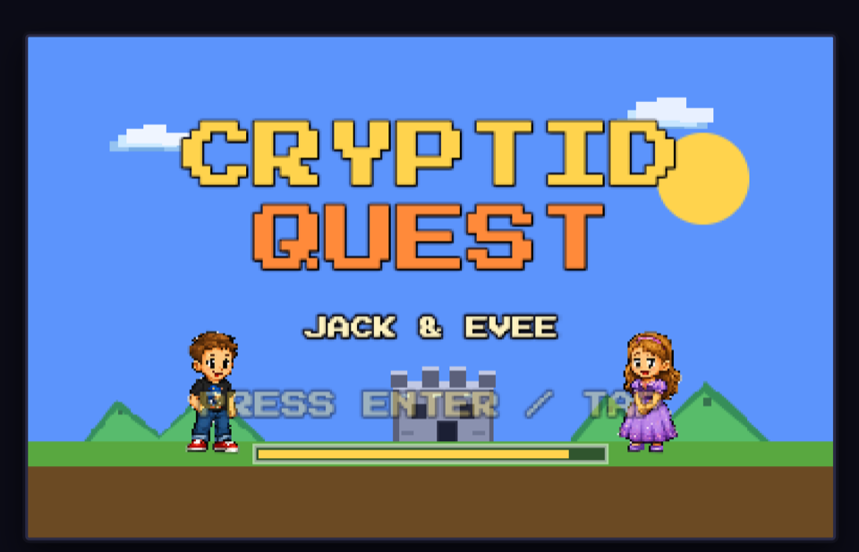
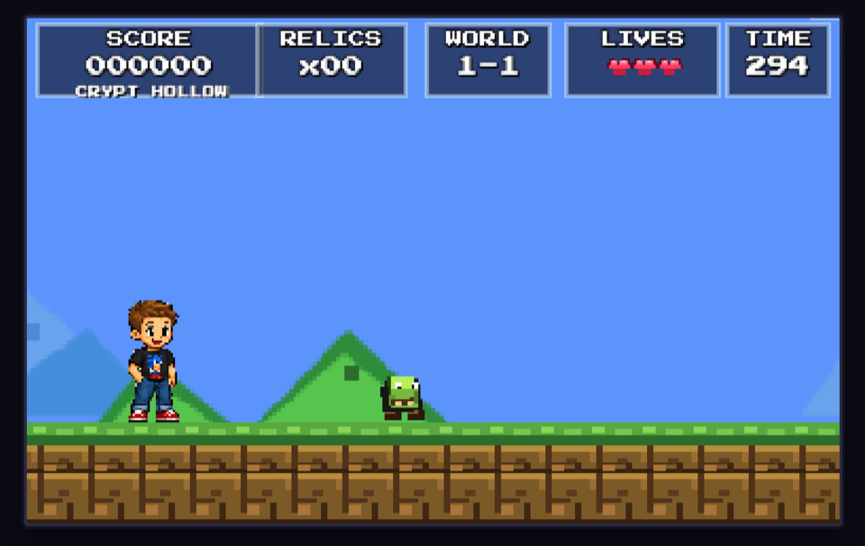

# Cryptid Quest

A web-playable 16-bit platformer inspired by classic SNES-era side-scrollers. Pick Jack or Evee, collect relics, dodge hazards, and stomp cryptids across four worlds.

## Previews





## Features

- Two playable heroes: Jack and Evee
- Four levels modeled after a classic 1-1 through 1-4 platformer arc
- Mythological cryptid enemies including Mothman, Chupacabra, and a Bigfoot boss
- Three lives, relic collection, power-ups, pause support, and touch controls
- 16-bit pixel-art look with parallax scenery, animated blocks, castle exits, flag lowering, and fireworks
- Underground 1-2 and castle 1-4 use grey terrain, bricks, and platforms while keeping question blocks gold

## Controls

| Action | Keyboard |
| --- | --- |
| Move | Left / Right arrows |
| Jump | Up arrow or Space |
| Pause | P or Esc |
| Select / Start | Enter or Space |

On touch devices, use the on-screen left, right, jump, and pause controls.

## Customizing the kids

The playable kids are generated from `assets/characters-source.png` at startup. To swap in different pictures, replace that image with a new transparent PNG that contains two separated full-body character sprites. The texture extractor automatically finds the two largest non-transparent character regions, crops the left one as `hero-jack`, and crops the right one as `hero-evee`.

Keep the new source image transparent around the characters, leave clear empty space between the two kids, and keep both characters roughly full-body and similarly sized. If you use the legacy/static asset path too, mirror the same file to `public/assets/characters-source.png`.

To change the displayed names, edit the hard-coded labels in `src/scenes/TitleScene.js`:

- Title/cast text: `JACK & EVEE`
- Character select cards: `JACK` and `EVEE`
- Start selection mapping: `jack` is the left card and `evee` is the right card

If you rename the internal character IDs, also update `hero-jack` / `hero-evee` texture usage and the `who` values passed into `LevelScene`.

## Run locally

```bash
npm install
npm run dev
```

Then open the local Vite URL shown in the terminal.

## Build

```bash
npm run build
```

## Have Fun!
