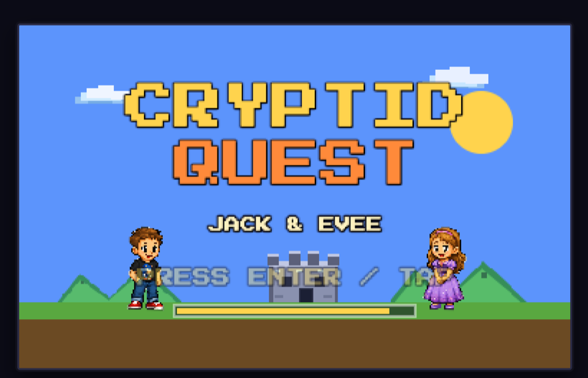
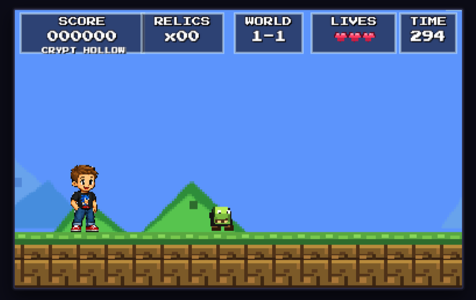

# Cryptid Quest

A web-playable 16-bit platformer inspired by classic SNES-era side-scrollers. Pick Jack, Evee, Curtis, or Toby, collect relics, dodge hazards, and stomp cryptids across four worlds.

## Previews





## Features

- Four playable heroes: Jack, Evee, Curtis, and Toby
- Four levels modeled after a classic 1-1 through 1-4 platformer arc
- Mythological cryptid enemies including Mothman, Chupacabra, and a Bigfoot boss
- Three lives, relic collection, power-ups, pause support, and touch controls
- 16-bit pixel-art look with parallax scenery, animated blocks, castle exits, flag lowering, and fireworks
- Underground 1-2 and castle 1-4 use grey terrain, bricks, and platforms while keeping question blocks gold

## Controls

| Action | Keyboard |
| --- | --- |
| Move | Left / Right arrows |
| Jump | Up arrow or Space |
| Pause | P or Esc |
| Select / Start | Enter or Space |

On touch devices, use the on-screen left, right, jump, and pause controls.

## Customizing the kids

The playable kids are generated from two source images at startup:

- `assets/characters-source.png`: Jack (left) and Evee (right)
- `assets/curtis-toby-source.png`: Curtis (left) and Toby (right)

Each image should contain two separated full-body character sprites on a transparent or near-white background. The texture extractor finds the two largest character regions and crops them in left-to-right order. If you use the legacy/static asset path too, mirror both files under `public/assets/`.

Hero IDs, displayed names, taglines, and source-image mappings live in `src/data/constants.js`.

## Run locally

```bash
npm install
npm run dev
```

Then open the local Vite URL shown in the terminal.

## Build

```bash
npm run build
```

## Have Fun!
